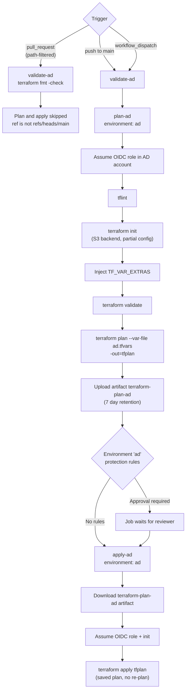

# Terraform Pipeline User Guide

This repo runs Terraform through GitHub Actions. Pipelines are split into two layers:

- **Entrypoint workflows** — one per environment. They own the triggers (push, PR, manual) and
  wire together the reusable jobs. Today only `ad.yaml` exists.
- **Reusable workflows** — `terraform-validate`, `terraform-plan`, `terraform-apply`,
  `terraform-destroy`. They are `workflow_call`-only building blocks and are never run directly
  from the Actions tab (with one caveat noted under [Destroy](#destroy)).

AWS access is never a static key. Every job that touches AWS assumes a role via GitHub OIDC, and
the role ARN comes from a **GitHub Environment secret**, so the environment name selects the AWS
account.

---

## Workflow inventory

| File | Type | Trigger | Touches AWS |
|---|---|---|---|
| `ad.yaml` | Entrypoint | `push` to `main`, `pull_request` (path-filtered), `workflow_dispatch` | Yes, via reusable jobs |
| `terraform-validate.yaml` | Reusable | `workflow_call` | No |
| `terraform-plan.yaml` | Reusable | `workflow_call` | Yes |
| `terraform-apply.yaml` | Reusable | `workflow_call` | Yes |
| `terraform-destroy.yaml` | Reusable | `workflow_call`, `workflow_dispatch` (non-functional) | Yes |
| `test-oidc-creds.yaml` | Standalone utility | `workflow_dispatch` | Yes, all environments |

---

## Environments and AWS accounts

Each GitHub Environment maps to one AWS account. The environment name passed to a reusable
workflow does three things at once:

1. Selects the `OIDC_ROLE_ARN` secret — and therefore the target AWS account.
2. Applies that environment's protection rules (required reviewers, branch restrictions, wait
   timers) to the job.
3. Selects the tfvars file: `terraform plan --var-file <environment>.tfvars`, resolved inside the
   caller's `working_directory`.

| Environment | AWS account role | Terraform code | Status |
|---|---|---|---|
| `ad` | `OIDC_ROLE_ARN` in env `ad` | `environments/ad/` | Active — full plan/apply pipeline |
| `dev` | `OIDC_ROLE_ARN` in env `dev` | none yet | Credentials only |
| `staging` | `OIDC_ROLE_ARN` in env `staging` | none yet | Credentials only |
| `prod` | `OIDC_ROLE_ARN` in env `prod` | none yet | Credentials only |
| `workspaces` | `OIDC_ROLE_ARN` in env `workspaces` | none yet | Credentials only |

Environment secrets:

| Secret | Required | Purpose |
|---|---|---|
| `OIDC_ROLE_ARN` | Yes | IAM role assumed via OIDC. Distinct per environment, so a `dev` run can never reach the `prod` account. |
| `TF_VAR_EXTRAS` | No | JSON map, e.g. `{"db_password":"..."}`. Each key is exported as `TF_VAR_<key>` before plan/apply/destroy. Use for values that must not live in a committed `.tfvars`. |

Secret values cannot be read back from GitHub. See [environments/](../../environments/) for the
per-environment record of which names must be configured.

---

## The AD pipeline

`ad.yaml` is the reference implementation. Three jobs run in sequence, each gated on the previous:

Key behaviours:

- **Apply consumes the saved plan artifact**, not a fresh plan. What was reviewed is exactly what
  is applied. If the artifact expired (7 days) or the plan job was skipped, apply fails at the
  download step.
- **`terraform plan` runs with `-detailed-exitcode` and `continue-on-error`.** Exit code `1` (a
  real error) fails the job at the final step; exit code `2` (changes present) and `0` (no changes)
  both proceed to apply.
- **The only human gate is the GitHub Environment.** Configure required reviewers on the `ad`
  environment if apply should not be automatic — there is no in-workflow approval step.

### Automatic triggers

| Event | What runs | Notes |
|---|---|---|
| PR touching `environments/ad/**` or `modules/ec2-windows-workload/**` | `validate-ad` only | Format check. Plan and apply are skipped because the ref is not `refs/heads/main`. |
| PR touching anything else | Nothing | The `pull_request` trigger is path-filtered. |
| Push to `main` (merge included) | `validate-ad` → `plan-ad` → `apply-ad` | **No path filter on `push`.** Any commit landing on `main` runs the full AD pipeline, even a README-only change. |

Because plan does not run on pull requests, the "Post Plan to PR" step in `terraform-plan.yaml`
never fires today. The plan you review is the one in the post-merge run on `main`.

---

## Running a pipeline manually

All manual runs start the same way: **Actions tab → pick the workflow in the left sidebar → Run
workflow**. You need `write` access to the repo, plus membership in any reviewer team configured
on the target environment.

### AD Environment Plan (`ad.yaml`)

**When to use it**

- Re-run after fixing an environment secret, a role trust policy, or a quota issue, without
  pushing an empty commit.
- Drift correction — re-assert state after someone changed the AD account by hand.
- Re-apply after a plan artifact expired.

**What you need**

- Branch: **`main`**. This is not optional. Plan and apply are guarded by
  `github.ref == 'refs/heads/main'`; dispatching from any other branch runs the format check and
  silently skips the rest.
- `OIDC_ROLE_ARN` present on the `ad` environment.
- Approval from a reviewer on the `ad` environment, if protection rules are configured.

**Inputs:** none. Region, working directory, backend bucket/key, and tfvars are all hardcoded in
`ad.yaml`. To change them, edit the file.

### Destroy

`terraform-destroy.yaml` declares `workflow_dispatch`, so it appears in the Actions UI, but it
defines **no dispatch inputs** — `working_directory`, `environment`, `aws_region`, and the backend
settings arrive only through `workflow_call`. A manual run resolves them to empty strings and
fails. No entrypoint workflow calls it, so today there is no working path to destroy an
environment through CI.

Tear down deliberately instead: run `terraform destroy` locally against the same backend, or add a
dispatch-input block to the workflow and call it from an entrypoint that requires a typed
confirmation. Either way, apply the same environment protection rules used for apply.

---

## Reusable workflow reference

Use these when adding a pipeline for a new environment.

### `terraform-validate.yaml`

Format check only — `terraform fmt -check -recursive`. No AWS credentials, no environment, no
secrets. Runs on every trigger including PRs, which makes it the cheapest early failure.

| Input | Required | Default |
|---|---|---|
| `terraform_version` | No | `1.16.0` |
| `working_directory` | No | `.` |
| `runs_on` | No | `ubuntu-latest` |

### `terraform-plan.yaml`

TFLint, init, validate, plan, artifact upload, optional PR comment.

| Input | Required | Default |
|---|---|---|
| `aws_region` | Yes | — |
| `working_directory` | Yes | — |
| `environment` | Yes | — |
| `s3_backend_bucket` | Yes | — |
| `s3_backend_key` | Yes | — |
| `terraform_version` | No | `1.16.0` |
| `tflint_version` | No | `0.64.0` |
| `post_pr_comment` | No | `true` |
| `runs_on` | No | `ubuntu-latest` |
| `retention_days` | No | `7` |

Secrets: `OIDC_ROLE_ARN` (required), `TF_VAR_EXTRAS` (optional).
Output: `plan_exitcode` — `0` no changes, `1` error, `2` changes pending. Callers can gate apply on
this; `ad.yaml` currently does not.

Requires `<environment>.tfvars` to exist in `working_directory`.

### `terraform-apply.yaml`

Downloads `terraform-plan-<environment>` and applies it. Takes the same required inputs as plan
minus the lint and comment options. Does not read tfvars — everything is already baked into the
saved plan.

### `terraform-destroy.yaml`

Same input surface as apply, but runs `terraform destroy --var-file <environment>.tfvars
-auto-approve` with no plan artifact and no confirmation. See [Destroy](#destroy).

---

## Adding a pipeline for a new environment

1. Create `environments/<name>/` with `main.tf`, `variables.tf`, `versions.tf` (S3 backend block
   with `use_lockfile = true`, values supplied at init), and `<name>.tfvars`.
2. Create the GitHub Environment under **Settings → Environments** and add `OIDC_ROLE_ARN` for
   that account's role. Add required reviewers for anything production-facing.
3. Confirm the role works by running **Test OIDC Credentials** and checking the account ID.
4. Copy `ad.yaml` to `<name>.yaml`, updating: the `pull_request` path filters, `working_directory`,
   `environment`, `s3_backend_bucket`, `s3_backend_key`, and `aws_region`.
5. Update [environments/README.md](../../environments/README.md) with the new row.

---

## Troubleshooting

| Symptom | Cause |
|---|---|
| Job stuck on "Waiting for review" | Environment protection rule. A configured reviewer must approve it in the run's summary page. |
| "Configure AWS credentials" fails with `Not authorized to perform sts:AssumeRoleWithWebIdentity` | The role's trust policy does not permit this repo, branch, or environment claim. Reproduce in isolation with **Test OIDC Credentials**. |
| Plan and apply skipped after a manual run | Dispatched from a branch other than `main`. Re-run from `main`. |
| Apply fails at "Download Terraform Plan Artifact" | The plan job was skipped or failed, or the artifact aged past `retention_days` (7). Re-run the whole entrypoint workflow. |
| Plan fails with a missing variable | The value belongs in `<environment>.tfvars` or in that environment's `TF_VAR_EXTRAS` JSON map. |
| `terraform fmt -check` fails | Run `terraform fmt -recursive` locally and commit. |
| State lock error | S3 native locking (`use_lockfile = true`). Another run is in flight, or a previous run was cancelled mid-apply and left a lock file next to the state object. |
