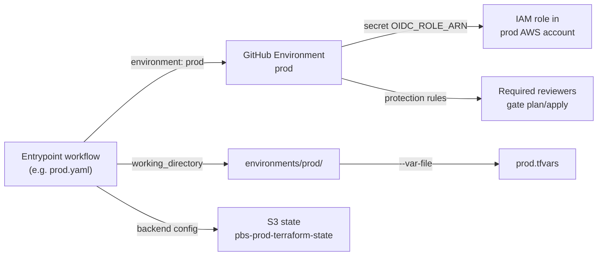
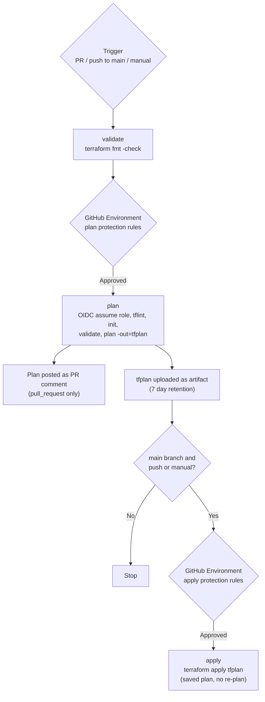

# terraform-aws-vm-migration

Terraform for the PBS VM migration to AWS: the landing infrastructure for workloads moved with
AWS Application Migration Service (MGN), the AD domain controllers, AWS Backup, CloudWatch
alarms and notification channels, and the AWS Organizations delegation that AWS Transform
depends on.

All Terraform runs in GitHub Actions. There are no local `init`, `plan`, or `apply` runs
against the shared state, except for `environments/org-delegation` (see
[Environments not run by CI](#environments-not-run-by-ci)).

> **Upcoming migration.** The `modules/` directory and the reusable `terraform-*.yaml`
> workflows are moving to external repositories shortly. See
> [Planned migration](#planned-migration-modules-and-reusable-workflows) before adding to
> either.

---

## Directory structure

```text
.
├── .github/
│   ├── workflows/
│   │   ├── ad.yaml, dev.yaml, staging.yaml,     Entrypoint workflows, one per environment
│   │   │   prod.yaml, workspaces.yaml
│   │   ├── ci-coverage.yaml                     Repo-wide coverage check + tflint of every directory
│   │   ├── terraform-{validate,plan,apply,      Reusable workflows (moving out, see below)
│   │   │   destroy}.yaml
│   │   └── README.md                            Pipeline user guide
│   ├── scripts/
│   │   ├── check_terraform_ci_coverage.py       Fails CI if a Terraform directory is not covered
│   │   └── test_check_terraform_ci_coverage.py  Mutation self-test for the checker
│   └── terraform-ci-coverage-exclusions.json    Directories deliberately not planned by CI
├── environments/                                Root modules, one per deployment target
│   ├── ad/                                      AD domain controllers, workstations, backup, alarms
│   ├── dev/  staging/  prod/  workspaces/       Per-account baselines: AWS Backup, CloudWatch alarms
│   ├── org-delegation/                          Organizations delegated admin (management account)
│   └── README.md                                Required GitHub Environment secrets
├── modules/                                     Reusable child modules (moving out, see below)
│   ├── backup/
│   ├── cloudwatch-alerts/                       SNS notification channels, Slack/Teams forwarder
│   │   └── lambda/                              Webhook forwarder Lambda source
│   ├── ec2-workload/
│   ├── instance-alarms/                         Per-instance disk, reachability, CPU, memory alarms
│   ├── managed-prefix-list/
│   ├── mgn-organizations-delegation/
│   └── ssm-session-access-policy/
├── scripts/                                     MGN replication agent installers for source VMs
│   ├── install-mgn-agent.sh                     Linux
│   └── Install-MGNAgent.ps1                     Windows
└── .tflint.hcl                                  Shared tflint config (AWS ruleset), used by all CI lint steps
```

Each directory under `environments/` follows the same layout:

| File | Purpose |
|---|---|
| `main.tf` | Resources and module calls for that environment |
| `variables.tf` / `outputs.tf` | Inputs and outputs |
| `versions.tf` | Pinned Terraform and provider versions, S3 backend with `use_lockfile = true` (bucket and key supplied at init) |
| `<environment>.tfvars` | Non-secret values. CI passes it as `--var-file <environment>.tfvars` |

Modules are consumed by relative path (`source = "../../modules/<name>"`). The module-to-environment
mapping is:

| Module | Consumed by |
|---|---|
| `backup` | `ad`, `dev`, `staging`, `prod`, `workspaces` |
| `cloudwatch-alerts` | `ad`, `dev`, `staging`, `prod`, `workspaces` |
| `ec2-workload` | `ad` |
| `instance-alarms` | `ad`, `dev`, `staging`, `prod`, `workspaces` (one call per instance) |
| `managed-prefix-list` | `ad` |
| `ssm-session-access-policy` | `ad` |
| `mgn-organizations-delegation` | `org-delegation` |

---

## Environments, secrets, and AWS accounts

Each Terraform environment is bound to a **GitHub Environment** of the same name. That name is
the single switch that selects the AWS account: the OIDC role ARN lives in the GitHub
Environment's secrets, so a `dev` run cannot assume the `prod` role.



| Environment | Directory | Workflow | GitHub Environment | State bucket / key | Status |
|---|---|---|---|---|---|
| `ad` | `environments/ad/` | `ad.yaml` | `ad` | `pbs-ad-ds-terraform-state` / `ad/terraform.tfstate` | Active |
| `dev` | `environments/dev/` | `dev.yaml` | `dev` | `pbs-dev-terraform-state` / `dev/terraform.tfstate` | Active |
| `staging` | `environments/staging/` | `staging.yaml` | `staging` | `pbs-staging-terraform-state` / `staging/terraform.tfstate` | Active |
| `prod` | `environments/prod/` | `prod.yaml` | `prod` | `pbs-prod-terraform-state` / `prod/terraform.tfstate` | Active |
| `workspaces` | `environments/workspaces/` | `workspaces.yaml` | `workspaces` | `pbs-workspaces-terraform-state` / `workspaces/terraform.tfstate` | Active |
| `org-delegation` | `environments/org-delegation/` | none | none | Supplied at manual init | Manual only, management account |

All environments deploy to `us-east-1`.

### Secrets per GitHub Environment

| Secret | Required | Purpose |
|---|---|---|
| `OIDC_ROLE_ARN` | Yes | IAM role assumed via GitHub OIDC. Distinct per environment; this is what maps the environment to its AWS account. |
| `TF_VAR_EXTRAS` | No | JSON map, e.g. `{"db_password":"..."}`. Each key is exported as `TF_VAR_<key>` before plan/apply. Use for values that must not be committed. |

No static AWS keys are stored anywhere. Secret values are write-only in GitHub, so
[environments/README.md](environments/README.md) records which names each environment needs.

This repository is public. Account IDs and other sensitive identifiers are not committed; supply
them through `TF_VAR_EXTRAS` or the environment's role.

### Environments not run by CI

`environments/org-delegation` registers AWS Organizations delegated administrators and must run
against the **organization management account**. CI's `OIDC_ROLE_ARN` secrets target workload
accounts, so this directory is intentionally excluded from plan/apply and recorded in
[`.github/terraform-ci-coverage-exclusions.json`](.github/terraform-ci-coverage-exclusions.json).
It is still linted by `ci-coverage.yaml`. See
[environments/org-delegation/README.md](environments/org-delegation/README.md) for how to run it.

---

## How the pipeline works

Every environment workflow runs the same three stages, calling reusable workflows from
[`pbs-common/terraform-aws-shared-ghpipeline`](https://github.com/pbs-common/terraform-aws-shared-ghpipeline),
pinned to a commit SHA.



| Event | What runs |
|---|---|
| Pull request touching the environment, a module it consumes, `.tflint.hcl`, or `.github/workflows/**` | validate and plan; plan posted to the PR |
| Push to `main` touching the same paths | validate, plan, then apply after environment approval |
| `workflow_dispatch` from `main` | validate, plan, then apply after environment approval |
| Any pull request | `ci-coverage.yaml` (no path filter) |

Key behaviours:

- **Apply uses the saved plan artifact** from the same run, so what was reviewed is what is
  applied.
- **The approval gate is the GitHub Environment's protection rules.** There is no in-workflow
  approval step.
- **Runs on the same Git ref are serialized per environment** (`concurrency` with
  `cancel-in-progress: false`), so a newer run on that ref does not cancel an in-progress apply
  and risk stranding the S3 state lock. Runs on different refs may overlap.

### CI coverage

`ci-coverage.yaml` runs on every pull request and:

1. Runs a mutation self-test proving the coverage checker still detects each defect it targets.
2. Runs `check_terraform_ci_coverage.py`, which fails if any directory under `environments/` or
   `modules/` is neither planned by a workflow nor listed in the exclusions file, or if a
   workflow's path filters miss a module its environment consumes.
3. Runs tflint, with the root `.tflint.hcl`, in every Terraform directory.

Full detail, troubleshooting, and the steps for adding a new environment are in
[.github/workflows/README.md](.github/workflows/README.md).

---

## Planned migration: modules and reusable workflows

Two parts of this repository are moving to external repositories shortly. This repository will
then contain only environment root modules, entrypoint workflows, CI coverage tooling, and the
MGN agent scripts.

### Reusable workflows

| Local file | Destination |
|---|---|
| `.github/workflows/terraform-validate.yaml` | `pbs-common/terraform-aws-shared-ghpipeline` |
| `.github/workflows/terraform-plan.yaml` | `pbs-common/terraform-aws-shared-ghpipeline` |
| `.github/workflows/terraform-apply.yaml` | `pbs-common/terraform-aws-shared-ghpipeline` |
| `.github/workflows/terraform-destroy.yaml` | `pbs-common/terraform-aws-shared-ghpipeline` |

The entrypoint workflows (`ad.yaml`, `dev.yaml`, `staging.yaml`, `prod.yaml`, `workspaces.yaml`)
**already call the shared repository**, pinned to a commit SHA. The local `terraform-*.yaml`
files are no longer invoked by any entrypoint and will be deleted. Make workflow changes in the
shared repository, then bump the pinned SHA in each entrypoint.

### Modules

Everything under `modules/` will move to external module repositories. Expected changes here
when that happens:

- Each environment's `source = "../../modules/<name>"` changes to a Git source pinned to a
  specific tag or commit.
- The `modules/**` entries drop out of each entrypoint workflow's `paths:` filters, and
  `check_terraform_ci_coverage.py` and the exclusions file are updated to match.
- Module changes no longer trigger a plan here; an environment picks up a module change only
  when its pinned version is bumped.

Until the move, coordinate any significant module changes so they are not lost in the cutover.

---

## Related documentation

- [.github/workflows/README.md](.github/workflows/README.md) — pipeline user guide, manual runs,
  troubleshooting, adding an environment
- [environments/README.md](environments/README.md) — GitHub Environment secret names
- [environments/org-delegation/README.md](environments/org-delegation/README.md) — Organizations
  delegation and how to run it
- `modules/*/README.md` — usage documentation for modules that provide it
